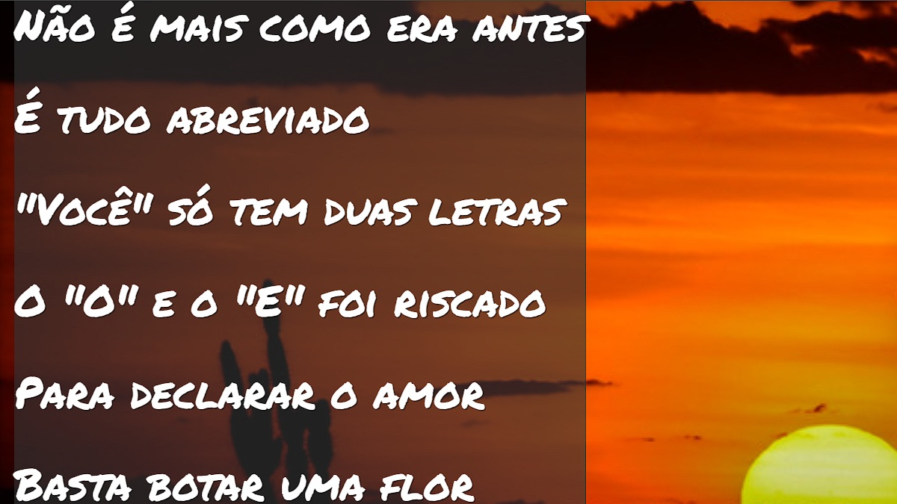

# 📜 Projeto Cordel

Uma experiência visual inspirada na literatura de cordel brasileira, desenvolvida com foco em efeitos visuais modernos, responsividade e valorização da cultura popular.

## 🚀 Sobre o projeto

O **Projeto Cordel** foi desenvolvido para praticar conceitos modernos de front-end utilizando efeitos de parallax, estilização criativa e uma proposta visual inspirada na tradicional literatura de cordel.

O projeto proporciona uma experiência imersiva através de:

* Efeito parallax
* Layout responsivo
* Tipografia estilizada
* Estrutura visual temática
* Experiência de leitura agradável

## 🛠️ Tecnologias utilizadas

* HTML5
* CSS3
* JavaScript
* Git & GitHub

## 📱 Responsividade

O projeto foi desenvolvido para funcionar corretamente em:

* 💻 Desktop
* 📱 Smartphones
* 📲 Tablets

## ✨ Funcionalidades

* Efeito parallax suave
* Estrutura temática inspirada em cordel
* Layout responsivo
* Experiência visual imersiva
* Organização moderna de conteúdo

## 🎯 Objetivos do projeto

* Evoluir habilidades em front-end
* Praticar efeitos visuais modernos
* Melhorar experiência do usuário
* Trabalhar responsividade
* Explorar criatividade em interfaces web

## 🌐 Deploy

Acesse o projeto online:

👉 https://renannavarro016.github.io/projeto-cordel/cordel.html

## 📸 Preview



## 📂 Como executar o projeto

```bash
# Clone o repositório
git clone https://github.com/seuusuario/projeto-cordel.git

# Abra o arquivo cordel.html
```

## 👨‍💻 Desenvolvedor

Desenvolvido por Renan Navarro.

## 📌 Status

✅ Projeto finalizado
